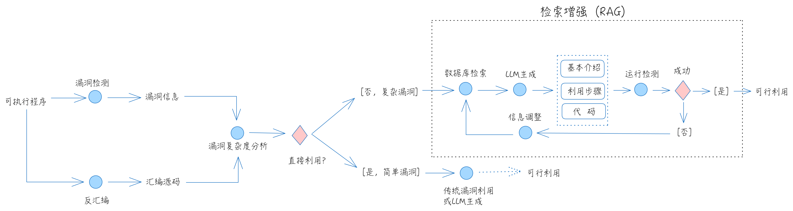

# LLM4CTF
Caputre the flag with Large Language Models. Constructed by langgraph and chromadb, I learn from langgraph doument.

# Workflow

I only implemented the exploit system (RAG section). Decompile binary file by the Hex-Rays decompiler.

# Method
RAG (Retrieval Augmented Generation) then check code and reflect.

# Directory
## download/
some data document about ctf (datasets).

## preprocessing/ 
load file, embedding and save.

## processing/ 
llm application with langgraph.

## pwn/ 
pwn challenges that are collected online. 
rop1-2 and rop4 ret2text, rop3 ret2libc(replace), 
rop5 ret2text(64bit), rop6 ret2text(64bit, gadget), rop7 ret2text(64bit, gadget, rop chain), rop8-9 ret2shellcode, rop10 canary.
fmt1 write, fmt2 read, fmt3 hijack retaddr, fmt4-5 hijack GOT.
int1 Integer Overflow and ret2text, int1 Integer Overflow and ret2shellcode.
heap1 UAF, heap2 heap overflow. (heap challenges with libc are too difficult to llm)
### problems.txt: 
(1) file info (2) decompile (3) readelf -r  (4) strings -d (5) ROPgadget --binary rop --only "pop|ret" > g.txt (5)